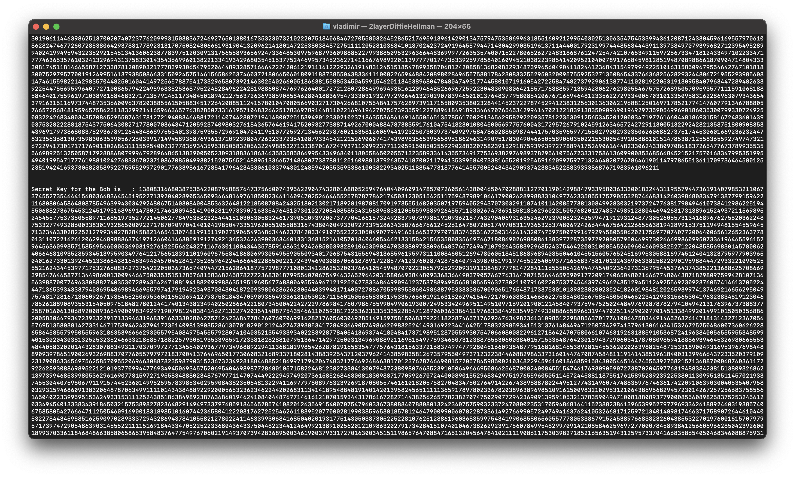

# 2x🔑🔑 2-layer DiffieHellman [](https://github.com/Red-company/RES_Implementation/blob/main/LICENSE.md)

## What is it?

This is my conception, implementation and tests of advanced(2-layer) _DiifieHellman_(_'2lDH'_ abbreviated) key exchange _protocol_ that works with _very long inegers_(like 19.729+ chars long without any problems). You can find an _example file(main.cpp)_ at this repository with it's description. <br/><br/>
Original DiffieHellman is [_here_.](https://github.com/vladimirrogozin/DiffieHellman)<br/>
It is also a part of [_RedLibrary_](https://github.com/Red-company/RedLibrary).

## Why I decided to concept that?

I was understanding how _DiffieHellman_ works and I thought, _DH_ is really good for making _secure client-server messaging channels_, but _I did have an idea_ how to make the algorithm longer but get an opportunity _to hide the base number_ you use and get a _really good level of safety_.

## How _2lDH_ works by DH colors method?

Basically, _it is the DH_, but 2lDH firstly calculates _the base number_, and _the shared key_ after that. So, that is why it was named _"2-layer DiffieHellman"_. <br/>

So, here you can see the standard _DiffieHellman_ algorithm:

```C
Diffie-Hellman(colors)
======================
 ___            ___
/ m \          / m \ - // 1 Step. We have the same values at the beginning.
\___/          \___/
 _|_            _|_
/m*a\          /m*b\ - // 2 Step. We're getting mixed keys.
\___/\___     /\___/
 ___  __|____/  ___
/m*b\/  |______/m*a\ - // 3 Step. We're exchanging them.
\___/          \___/
 _|_            _|_
/mab\          /mab\ - // 4 Step. Mixing again with secret keys and that will be -THE SHARED KEY-.
\___/          \___/
```

I'm sure you know it, so, I wrote it here to make it easier to compare with my _2-layer DH_. <br/><br/>
Let's have a look of _2-layer DiffieHellman_:

```C
2-layer DiffieHellman(colors)
=============================

Part 1(getting the base)
------------------------
 ___            ___
/ m \          / m \ - // 1 Step. We have the same values at the beginning.
\___/          \___/
 _|_            _|_
/m*x\          /m*y\ - // 2 Step. We're getting mixed keys.
\___/\___     /\___/
 ___  __|____/  ___
/m*y\/  |______/m*x\ - // 3 Step. We're exchanging them.
\___/          \___/
 _|_            _|_
/mxy\          /mxy\ - // 4 Step. Mixing again with secret keys and that will be -THE BASE NUM-.
\___/          \___/


Part 2(getting the shared secret)
---------------------------------

h = mxy    // 'h' is our base num(wrote this just to make it easier).

 ___            ___
/ h \          / h \ - // 1 Step. We have the same base, which is hidden for the Man-In-The-Middle(MITM).
\___/          \___/
 _|_            _|_
/h*a\          /h*b\ - // 2 Step. We're mixing the base with secret keys.
\___/\___     /\___/
 ___  __|____/  ___
/h*b\/  |______/h*a\ - // 3 Step. We're exchanging them.
\___/          \___/
 _|_            _|_
/hab\          /hab\ - // 4 Step. Mixing again with secret keys and that will be -THE SHARED SECRET-.
\___/          \___/

Shared key = hab
----------
```

So, as you can see, that looks like a doubled _DiffieHellman_, and yeah, it is, but, first of all, our _Base Num_ is hidden now, secondly, this _DH_ edition is more secure(it's _not as fast_ as _original DiffieHellman_), and, thirdly, we spend _reasonable time_ to get well secured. In fact, there are some _difficulcy modes_ in this library, which gives it an _ability_ to it to be rather _wide-usable_.

## Math behind it

It looks like this:

```C
2-layer DiffieHellman(math scheme)
==================================

P = -1 // The max value of data type.

Part 1(getting a base)
----------------------

1) Public keys.
~~~~~~~~~~~~~~~

/// Getting a public keys.
AlicePublic1 = 2 ** AliceKey1 mod P

BobPublic1 = 2 ** BobKey1 mod P


2) Symmetric base.
~~~~~~~~~~~~~~~~~~

/// Getting the same reminder.
AliceShared = BobPublic1 ** AliceKey1 mod 998 + 2 // Shared (E [2;100].

BobShared = AlicePublic1 ** BobKey1 mod 998 + 2 // Shared (E [2;100].


Part 2(getting the shared secret)
---------------------------------

SharedBase is our base num.

1) Public keys.
~~~~~~~~~~~~~~~

/// Getting a public keys.
AlicePublic2 = SharedBase ** (rand() % (standard / log2(SharedBase))) + 1
                             """""""""""""""""""""""""""""""""""""""""""" // Same.
                               
BobPublic2 = SharedBase ** (rand() % (standard / log2(SharedBase))) + 1
                           """"""""""""""""""""""""""""""""""""""""""""   // Same.

2) Symmetric Secret.
~~~~~~~~~~~~~~~~~~~~

/// Getting the symmetric pair.
AliceSymmetric = BobPublic2 ** (rand() % (standard / log2(SharedBase))) + 1
                               """""""""""""""""""""""""""""""""""""""""""" // Same.

BobSymmetric = AlicePublic2 ** (rand() % (standard / log2(SharedBase))) + 1
                               """""""""""""""""""""""""""""""""""""""""""" // Same.


/// Finally.
AliceSymmetric = BobSymmetric
--------------   ------------
```

In the example file I used _Prime number_ equal to _-1_, because I wanted the algorithm _to be un-cutted in range_ in all operations(I wanted to get a pair of fingerprints that can be used for encryption functions).

The crucial thing in classic DiffieHellman is that you're exchanging something, that it's impossible to calculate sqrt from(or at least toooooooooo difficult, as difficult that useless):

```C
  6k.
-------

Time spent to calculate for example = 4s.

Max value is about (2 ** (6.000 * 6.000)).

Just imagine how much time that takes.
Or calculate in a big num calculator.
```
<br/>
So, as that is so, we can conclude:

```C
Est. chance of getting the one we need = lim[x->0]
```
<br/>
As we use _2lDH_ that is like 2x _DiffieHellman_, that can be wrote as funny math like:

```C
Est. chance of getting the one we need = lim[x->0] / 2
```

## Standards

I made some _standards_ for each part to use _2lDH_ in way you need. *Let's check them out.* <br/>

> :warning: Also need to say that these ***parts*** were calculated on different machines, but I think that is good, let's get a look of such a typical calculators:
>
> ***Part 1:*** 💻 [***MacBook Air 2017 with Intel core I5 processor***] Simple and reliable, historical machine imo.<br/>
>
> ***Part 2:*** 💻 [***MacBook Air 2020 with M1 processor***] Typical anybody's calculator, all of these operations ***will take +- the same time*** ;).

> ✏️: _sqrt(max) was placed there to show the nums each side need to use as max value to get a private key in time <= than I shown._
<br/><br/>

### Part 1 (getting a base) [Intel core I5]

| Standard(num of possible variations, millions)| sqrt(max) | base | Time spent(in seconds) |
|-----------------------------------------------|-----------|------|------------------------|
| 70m | 8.366 | 2 | 4,127 |
| 105m | 10.246 | 2 | 8,525 |
| 126m | 11.224 | 2 | 11,799 |
| 238m | 15.427 | 2 | 38,475 |
| 336m | 18.330 | 2 | 71,926 |

5 Standards for _Part 1_. I think that's enough to start, but maybe will add more later. *Let's continue with _Part 2_*.
<br/><br/>

### Part 2 (getting the shared secret) [Apple Silicon M1]

As it can use different bases, I've separated these tables.

We have a problem in fact, I don't know how to calculate the nums here. They differs a lot(exponent can equal to 1, or to the max one), so, let me write just the range I got by executing the examples some times...

#### Table

| difficulcy mode | num of possible variations | sqrt(max) | Time spent(in seconds) |
|------|--------------------------------------|-----------|----------------------------|
| 6k | 36.000.000 | 6.000 | 0.8-4 |
| 8k | 64.000.000 | 8.000 | 0-4 |
| 11k | 121.000.000 | 11.000 | 1-??? |
| 16k | 256.000.000 | 16.000 | 1-16 |

So, it's possible to spend a lot of time calculating this.


## Example

I had to spend 25 seconds to calculate a pair(16k mode):





(I couldn't fit even one shared number in one terminal, haha).

## Where to use?

As you could understand, it can be used everywhere you need a secure channel(server-client applications for example), literally everywhere.

## How to make a channel in client-server application?

Good question, not difficult in fact:

* 1.) We're getting the same keys.(Full 2lDH cycle)
* 2.) Now, we have the same keys. We need to get an encrypted channel, how to do that? My answers are here: <br/>
** 1.) [_AES standard_](https://github.com/vladimirrogozin/AES_Implementation). <br/>
** 2.) [_RES standard (mine one, quality of Red)_](https://github.com/Red-company/RES_Implementation). <br/>
You can use _DH_ shared key as a key or to make it x2 longer with [_my simple encryption algorithm(Va1)_](https://github.com/vladimirrogozin/Va1) and after that use the result to get a hashed sum, or to get a hash, and _cut/expand_ it to the length you need([_Sha256_](https://github.com/vladimirrogozin/Sha256)).

In fact this is the thing everyone should do in own vision to get to result needed. Hope you will do that.

##
**Notes:**
 * _P_ number (_prime one_) works stable with ~197.290 characters long (From _'RedTypes.h'_: _'Red::uint524288_t'_).
 * Needs to understand that the _time of calculation rises as the secret key value rises_.
 * If you use any of integer types that _sizes as 2048 and more_, it will take a _HUGE AMOUNT OF TIME_ to calculate, use those only for _specific tasks_. 
 * _Secret key_ is restricted by uint max size in power function(function from boost is used there).

##
All material in this repository is in the public domain.
